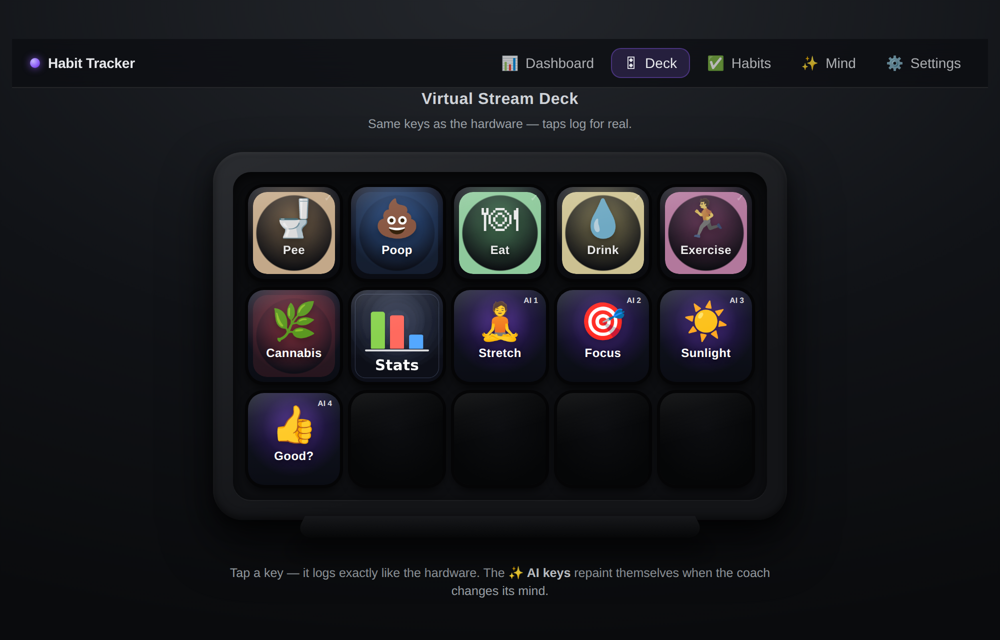
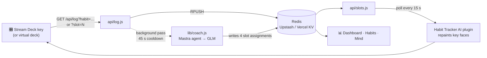
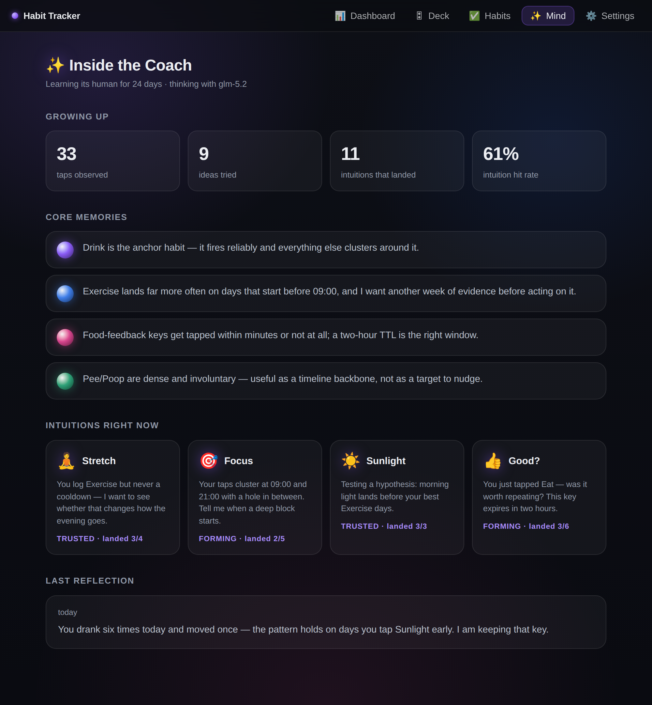
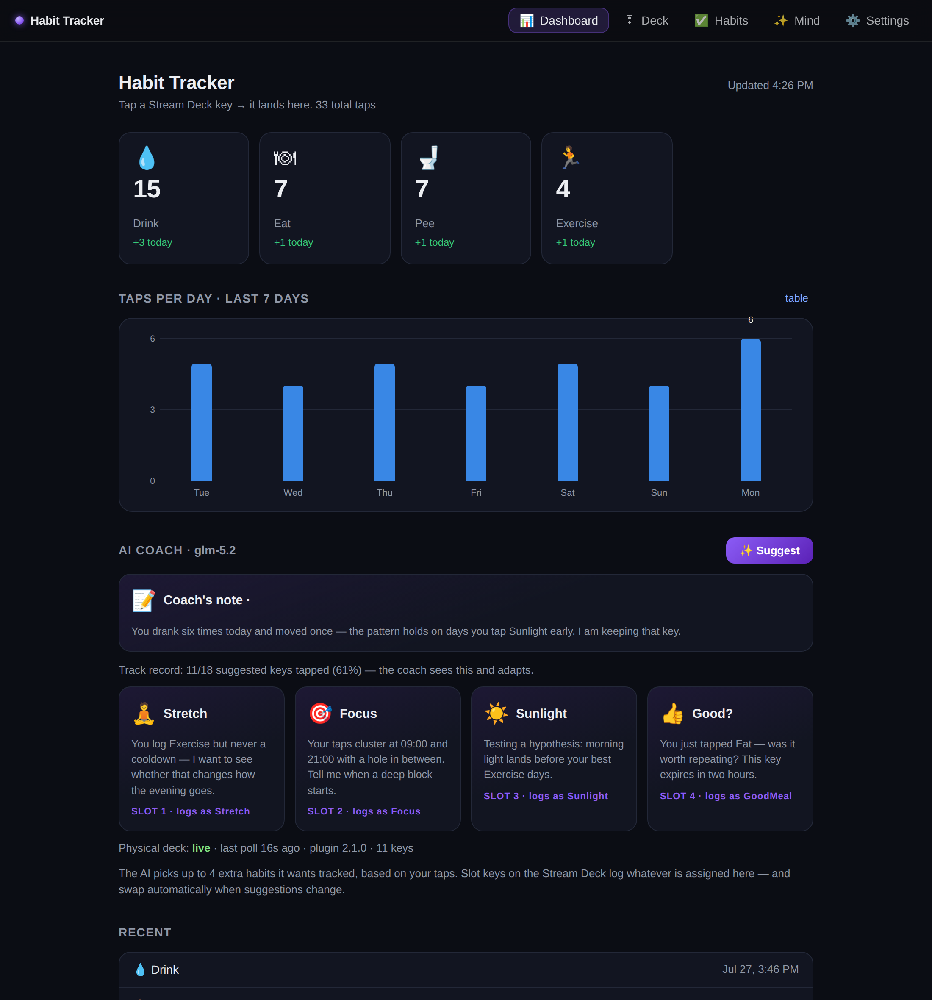
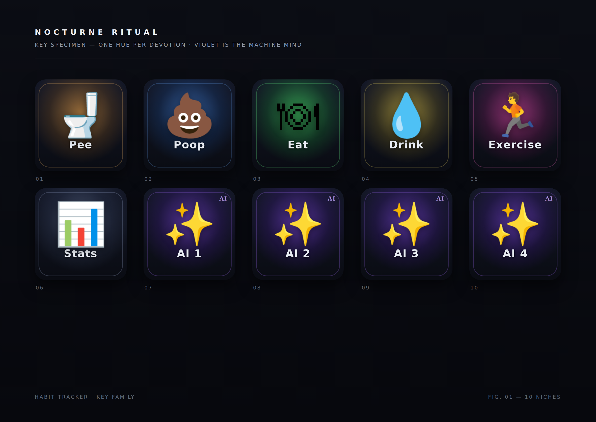

<div align="center">

# Habit Tracker

### A Stream Deck that tracks your habits — and an AI coach that decides what to ask you next.

Tap a physical key, and a timestamped row lands in the cloud. No server to run, no phone app,
no friction. Then the coach takes over the spare keys and starts asking better questions.

[**Live app**](https://stream-deck-habit-tracker.vercel.app) ·
[**Virtual deck**](https://stream-deck-habit-tracker.vercel.app/deck.html) ·
[**Inside the coach**](https://stream-deck-habit-tracker.vercel.app/mind.html) ·
[**Deploy your own**](#deploy-your-own)

[](https://github.com/shaiss/StreamDeckHabitTracker/actions/workflows/ci.yml)
[](LICENSE)




<sub>The virtual deck — a browser twin of the 15-key hardware. The four violet keys are the coach's.</sub>

</div>

---

## What it is

Habit tracking usually fails on the capture step. Apps demand an unlock, a scroll, and a tap;
by the time you've done that, you've forgotten why you opened the phone. A Stream Deck key is
one thumb-press away, always visible, and never asks you to context-switch.

Habit Tracker turns that key into a logger. Each press sends a single web request to a
serverless endpoint; the row lands in Redis and shows up on a live dashboard within seconds.
Nothing runs on your desktop but the Stream Deck app itself — there's no companion service to
install, no local database, and no sync daemon. Your history lives in the cloud, so the
dashboard, the coach, and the virtual deck reach it from any device, anywhere.

The other half is the coach. Beyond your fixed habits, up to four keys are **AI slots** — the
coach reads your real tap history and decides what it wants tracked, then writes those habits
onto the physical keys. The key faces repaint themselves. It is a tracker that asks follow-up
questions.

## Highlights

| | |
|---|---|
| 🔌 **No server to run** | The backend is serverless and the store is hosted. Nothing to install beyond the Stream Deck app, no local database, no sync daemon. |
| ✨ **AI slot keys** | An LLM picks up to 4 habits it wants tracked and assigns them to real keys, each with an emoji, label, and a stated reason. |
| ⚡ **Reactive, not scheduled** | Every tap triggers a background coach pass (45 s cooldown). Tap 🍽 Eat and 👍/👎 food-feedback keys can appear seconds later. |
| 🎛 **Living key faces** | The bundled Stream Deck plugin polls server state and repaints physical keys — progress rings, streaks, and new AI assignments, no re-import. |
| 🧠 **It remembers** | The coach keeps persistent hypothesis notes across passes and reads them back at the start of the next one. |
| 📉 **It learns what you ignore** | A behavioral scorer tracks which suggested keys you actually tapped, and feeds that record back into every pass. |
| 🗂 **Self-managing roster** | The coach can propose adding or retiring *fixed* habits — but nothing applies without your approval. |
| 🖥 **No hardware required** | The virtual deck is a browser twin of the 15-key device: same faces, same live slots, real logging. |
| 🔬 **Evaluated, not vibes** | Every coach pass is captured into a dataset; a replay endpoint scores model-vs-model on your real production contexts. |

## Quick start

### What you need

An Elgato Stream Deck (7.1+) and the host computer it plugs into. **The deck has no network
hardware of its own** — it's a USB device, and the Stream Deck app on its host makes the HTTPS
call, so that machine has to be awake and online for a physical tap to land. What you *don't*
need is a machine you control staying up to serve anything: the backend is serverless, so the
dashboard, the coach, and the virtual deck keep working from any device no matter what the
deck's host is doing.

No deck at all? The [virtual deck](#no-stream-deck) needs nothing but a browser.

### Have a Stream Deck? (Windows, one line)

```powershell
irm https://stream-deck-habit-tracker.vercel.app/setup.ps1 | iex
```

That's the whole install. The script installs the Elgato Stream Deck app if it's missing
(via winget), then performs a **clean install**: it downloads, extracts, and validates
everything *before* touching anything on disk, then removes any previous copy of the plugin
(including the legacy `com.kalmansforge` build) and any imported `Habit Tracker*` profiles,
drops the plugin straight into the plugins folder with no prompt, and imports the fresh
profile — the one prompt you'll confirm.

**Re-running the one-liner is the upgrade path.** It never stacks duplicate profiles or
leaves a stale plugin behind. No repo clone, no Node, nothing else on your machine.

<details>
<summary>Manual install / macOS</summary>

Download and double-click the two artifacts below — **plugin first, then profile**. Note
that the manual path does *not* remove old copies, so upgrades can leave a stale plugin or
duplicate profiles behind.

| File | What it is |
|---|---|
| [`setup.ps1`](https://stream-deck-habit-tracker.vercel.app/setup.ps1) | the Windows bootstrap above |
| [`com.shaiss.habit-tracker.streamDeckPlugin`](https://stream-deck-habit-tracker.vercel.app/downloads/com.shaiss.habit-tracker.streamDeckPlugin) | the plugin — live habit keys + live AI slot keys |
| [`HabitTracker-MK2.streamDeckProfile`](https://stream-deck-habit-tracker.vercel.app/downloads/HabitTracker-MK2.streamDeckProfile) | 15-key layout: habit keys + Stats + up to 4 AI slots |

Other deck models can be generated on demand — see [Regenerating artifacts](#regenerating-artifacts).

</details>

### No Stream Deck?

Open the [**virtual deck**](https://stream-deck-habit-tracker.vercel.app/deck.html). It's a
browser twin of the 15-key hardware — same faces, same live AI slots, real logging into the
same store. Append `?key=...` if `HABIT_KEY` is set on the deployment.

## How it works



1. **A tap is one HTTP request.** `GET /api/log?habit=Drink` appends `{h, t, note?, e?, slot?}`
   to a Redis list. That's the entire write path — no client, no queue, no daemon.
2. **Slot taps resolve server-side.** A slot key sends `?slot=2`; the server looks up what's
   assigned to slot 2 *at tap time* and stores that habit's name and emoji in the row. Swaps
   never rewrite history.
3. **The coach runs after the response.** `/api/log` answers immediately, then a background
   pass (via `waitUntil`) shows the model what you just tapped, today's taps, its current keys,
   and its own prior notes — and lets it repaint slots right now.
4. **The plugin polls and repaints.** One `/api/slots` poll drives every face. After a tap it
   queues a short chain of rechecks (2/5/9/15/25 s), so a reactive swap reaches the physical
   key within seconds rather than at the next 15 s tick.

### The AI coach

The coach is a [Mastra](https://mastra.ai) agent backed by z.ai's GLM models. It has six entry
points, and a two-tool memory loop (`recall_hypotheses` / `update_hypotheses`) whose bytes
persist in Redis so they survive serverless cold starts.

> 📘 **[How we use Mastra](docs/MASTRA.md)** — the agent wiring, why memory is tools over
> Redis instead of Mastra's own memory, the `thinking: disabled` guardrail that GLM-5.x
> requires, the trust boundary around model output, and how to add a seventh pass.

| Pass | Trigger | What it does |
|---|---|---|
| **Reactive** | every tap, 45 s cooldown | Sees the tap in context; may repaint slots immediately |
| **Full refresh** | ✨ Suggest on the dashboard | Re-thinks all 4 slots against a 14-day summary |
| **Morning** | cron, 10:00 UTC | Sets the day's keys |
| **Nudge** | rides the deck's `/api/slots` poll | Proactive single-slot repaint when the gates allow |
| **Roster** | after the morning pass | Proposes adding/retiring *fixed* habits — queued for your approval, never self-applied |
| **Daily digest** | cron, 03:00 UTC | Writes the end-of-day note shown on the dashboard |

Reactive feedback keys **expire on their own** (default 2 h; the model can set `ttlMinutes`
between 15 and 720), so a "was that meal any good?" key doesn't squat a slot all day.

The [**Mind page**](https://stream-deck-habit-tracker.vercel.app/mind.html) exposes all of it:
the coach's current notes, its live intuitions, its behavioral hit rate, and its latest
reflection. Every suggestion carries the coach's stated reason and its own track record, so
you can see *why* a key is on your deck and whether that instinct has been paying off.



### Where the data lives

Two Redis keys carry the whole product: `habits:log` (an append-only list of taps) and
`habits:slots` (the current four assignments). Everything else — the dashboard, the streaks,
the scorer, the datasets — is derived. Days are grouped in *your* timezone, not the server's.

## Deploy your own

The hosted app is a live single-user deployment. To run your own instance:

**1. Deploy the repo to Vercel.** Fork it, import the fork into Vercel, and deploy. There's no
build step — `public/` is served static and `api/*.js` become Node functions.

**2. Connect storage** (~1 min). In Vercel → your project → **Storage** → create
**Upstash for Redis** (or **KV**) on the free tier → **Connect** it to the project. Vercel
injects the credentials and redeploys; the code auto-detects any of the standard REST
variable names. Until this is done, the dashboard shows a "connect storage" note and
`/api/log` replies `503 Storage not connected yet` — that's expected, not broken.

Verify with `https://YOUR-APP.vercel.app/api/log?habit=Test` in a browser. You should see
`Logged: Test`, and it should appear on the dashboard.

**3. Enable the coach** (optional). Add `ZAI_API_KEY` from [z.ai](https://z.ai) under
**Settings → Environment Variables**, then redeploy. Without it, everything except the AI
slots works normally.

**4. Generate your own deck artifacts.** The hosted plugin and profile point at the reference
deployment, so build ones that point at yours:

```bash
node tools/generate.mjs "https://YOUR-APP.vercel.app/api/log" \
  --plugin --static \
  --outfile=public/downloads/HabitTracker-MK2.streamDeckProfile \
  --name="Habit Tracker AI"
```

Add `--model=mk2|neo|xl|mini|original` for a different device, `--key=SECRET` if you set
`HABIT_KEY`, and `--slots=N` to change how many AI slots to reserve. If you plan to use the
one-liner installer, also point `$base` in [`public/setup.ps1`](public/setup.ps1) at your
deployment. Then commit the rebuilt artifacts — Vercel runs no build step, so
`public/downloads/` is the published copy.

### Configuration

Every variable is optional; the app degrades cleanly without each one.

| Variable | Default | What it does |
|---|---|---|
| `KV_REST_API_URL` / `KV_REST_API_TOKEN` | — | Redis over REST. `UPSTASH_REDIS_REST_*`, `REDIS_REST_*`, and `STORAGE_REST_API_*` are all detected too — connecting either Vercel integration is enough. |
| `ZAI_API_KEY` | — | Enables the coach. `Z_AI_API_KEY`, `GLM_API_KEY`, and `ZHIPU_API_KEY` also work. |
| `ZAI_MODEL` | `glm-5.2` | Coach model. Falls back to the free `glm-4.7-flash` if the preferred model rejects a call. |
| `ZAI_BASE_URL` | `https://api.z.ai/api/paas/v4` | Point at a different OpenAI-compatible endpoint. |
| `HABIT_KEY` | — | Shared secret. When set, every write needs `?key=…` — including the plugin's heartbeat, so nobody can forge "the hardware is live". |
| `HOME_TZ` | `America/New_York` | Default timezone for coach passes. The timezone in ⚙️ Settings overrides it. |
| `CRON_SECRET` | — | Locks the two cron routes. |

> Environment variables bind at deploy time. After adding one in Vercel, redeploy (any push)
> before the functions can see it.

## API

Everything is a plain HTTP endpoint — usable from a browser, `curl`, a shortcut, a watch
complication, or anything else that can make a request.

| Endpoint | Purpose |
|---|---|
| `GET /api/log?habit=NAME[&note=…][&key=…]` | Log a tap. Returns plain text, so it's testable in a browser. |
| `GET /api/log?slot=N` | Log whatever the coach currently has in slot *N* (1–4). |
| `GET /api/slots[?tz=…][&track=1]` | Current assignments, today's per-habit progress, and optionally the behavioral scorecard. Read by the plugin and the dashboard. |
| `GET /api/data` | Every tap, as JSON. Feeds the dashboard. |
| `GET /api/habits` · `POST /api/habits` | The live habit list, plus the coach's inventions with their behavioral stats. |
| `POST /api/suggest` (or `GET ?run=1`) | Full slot refresh. 30 s cooldown. |
| `GET /api/nudge[?run=1]` | Nudge state and gate evaluation; `?run=1` forces a pass. |
| `GET /api/roster[?run=1]` · `POST /api/roster` | Pending roster proposals and the retirement archive; POST approves, dismisses, or restores. |
| `GET /api/mind` | Everything the Mind page renders, in one call. |
| `GET /api/profile[?set=1&…]` | Name, timezone, and the free-text "about you" the coach reads each pass. |
| `GET /api/health` | Storage + AI wiring, and when a *physical* deck last polled. Returns variable **names** only, never values — safe to leave public. |
| `GET /api/experiment?run=1&models=a,b&n=3` | Replay captured coach contexts against several models and score them. |

Reads are open-CORS; writes honor `HABIT_KEY` when it's set.

## The web app

| Page | What it's for |
|---|---|
| [`/`](https://stream-deck-habit-tracker.vercel.app) | Dashboard — counts, a 7-day chart, recent taps, the coach's slots and daily note, and deck liveness |
| [`/deck.html`](https://stream-deck-habit-tracker.vercel.app/deck.html) | Virtual deck — the 15-key device in a browser tab |
| [`/habits.html`](https://stream-deck-habit-tracker.vercel.app/habits.html) | Habit manager — edit the list, review roster proposals, promote the coach's inventions to fixed keys |
| [`/mind.html`](https://stream-deck-habit-tracker.vercel.app/mind.html) | Inside the coach — memories, intuitions, confidence, reflections |

Edits on the Habits page go live everywhere, including physical key faces, within ~15 s.
Single static HTML files, no framework, no build step.



## The Stream Deck plugin

`Habit Tracker AI` is a Node-runtime plugin (Stream Deck ≥ 7.1 spawns it under its bundled
Node 24). It ships two actions:

- **Habit Key** — resolves the habit at a given grid position from live server state, so
  edits in the habit manager repaint the key without a re-import.
- **AI Slot Key** — renders whatever the coach has assigned to that slot right now.

Both draw their faces from a single `/api/slots` poll and resolve taps server-side. Faces are
rendered as SVG data URIs in the [Nocturne Ritual](design/PHILOSOPHY.md) style — one hue per
habit, derived from its name and kept for life; violet is reserved for the machine mind.

Wondering whether the hardware is actually talking to the backend? The dashboard's AI Coach
section reports **Physical deck: live / stale / never seen** along with the plugin version and
key count, and `GET /api/health` returns the same under `deck`.

<details>
<summary>Icons and key art</summary>

Two committed sets: [`icons/animated/`](icons/animated/) (looping GIFs, 24 frames, 1.92 s;
embedded in the profile by default) and [`icons/`](icons/) (still PNGs, 576×576; used with
`--static`, or drag one onto a key manually).

PNG for stills and GIF for animation is a deliberate choice: the art is color-emoji glyphs,
which render inconsistently as SVG text and gain nothing from vectors at 72–96 px, and GIF is
the most widely supported animated format on keys. If an imported profile ever shows only the
first frame, drag the `.gif` from `icons/animated/` onto the key — the app plays dragged GIFs.

</details>

## Development

```
api/          Vercel Node functions (log, slots, suggest, nudge, roster, mind, …)
lib/          coach, Mastra agent, store, roster rules, scorer, quality scoring
public/       dashboard, virtual deck, habit manager, mind page, setup.ps1, downloads
streamdeck-plugin/   plugin source (src/) + the .sdPlugin package
tools/        icon, animation, profile, and plugin-package generators
tests/        unit (zero-dep) + e2e (Chromium and a mock Stream Deck)
config/       seed habit list for icon and profile generation
design/       Nocturne Ritual design philosophy and key specimen
docs/         deep dives (see below) + README screenshots
```

**Deep dives**

| Doc | What's in it |
|---|---|
| [How we use Mastra](docs/MASTRA.md) | Agent wiring, the memory-as-tools decision, the GLM `thinking: disabled` guardrail, the model-output trust boundary, datasets and experiments, how to add a pass |
| [Nocturne Ritual](design/PHILOSOPHY.md) | The design philosophy every surface follows |

```bash
# Tests. Unit tests are zero-dependency by design.
npm test          # unit suite
npm run test:e2e  # habit-manager flows in Chromium + the real plugin against
                  # a mock Stream Deck WebSocket server

# Tool dependencies are intentionally not in package.json — runtime deps stay
# lean so Vercel's build stays trivial. Install them once per machine:
npm i playwright-core pngjs gifenc esbuild @elgato/streamdeck --no-save
```

Both suites run in CI on every pull request, alongside a `node --check` pass over every
tracked `.js`/`.mjs` file. New UI behavior ships with a regression test.

### Regenerating artifacts

Built artifacts are committed, and nothing rebuilds them automatically:

```bash
node tools/make-icons.mjs        # still PNGs      -> icons/
node tools/make-animations.mjs   # looping GIFs    -> icons/animated/
node tools/bundle-plugin.mjs     # src/            -> bin/plugin.js
node tools/build-plugin.mjs      # full .streamDeckPlugin package
node tools/generate.mjs "<base-url>" --plugin --static   # .streamDeckProfile
node tools/screenshots.mjs        # README screenshots -> docs/screenshots/
```

`tools/screenshots.mjs` renders the real pages from `public/` against a mock backend with demo
data — the same harness the e2e suite uses — so the screenshots in this README track the UI
instead of drifting from it.

The generators read the **live** habit list from `/api/habits`, falling back loudly to
`config/habits.json` when the deployment is unreachable.

## Troubleshooting

| Symptom | Fix |
|---|---|
| `503 Storage not connected yet` | Connect Upstash or KV in Vercel, then redeploy. |
| A key does nothing | Open its URL in a browser. `Logged: …` = working. `Unauthorized` = the URL is missing `&key=…` while `HABIT_KEY` is set. `Missing habit` = the `?habit=` part got dropped. |
| Physical faces look stale | Check `GET /api/health` → `deck`. `null` means the plugin has never connected — that's a plugin problem, not a backend one. |
| Profile won't import | Stream Deck's profile format varies by version. Use the plain URLs in `dist/urls.txt` from the generator and paste them into keys manually — same result. |
| Days roll over at the wrong time | They don't: the dashboard groups by *your browser's* local day. Set the coach's timezone in ⚙️ Settings. |
| Nothing happens after a plugin change | Run `node tools/bundle-plugin.mjs`. `bin/plugin.js` is a committed build artifact — an un-rebuilt change ships stale. |

## Alternative: Google Sheets instead of Vercel

Prefer your data in a spreadsheet? [`apps-script/Code.gs`](apps-script/Code.gs) is a drop-in
Apps Script logger — paste it into **Extensions → Apps Script**, deploy as a Web app
("Execute as: Me", "Who has access: Anyone"), and point the generator at the `/exec` URL
instead. You trade the dashboard and the coach for a sheet you already know how to use. See
[`sheet/dashboard.md`](sheet/dashboard.md) for the formulas.

## Design

The whole surface — key faces, dashboard, virtual deck — follows one design philosophy:
[**Nocturne Ritual**](design/PHILOSOPHY.md). Luminous glyphs on deep night surfaces, one hue
per habit derived from its name and kept for life, and violet reserved for the machine mind.
Violet always means *the coach is speaking*.



## License

MIT — see [LICENSE](LICENSE).
</content>
