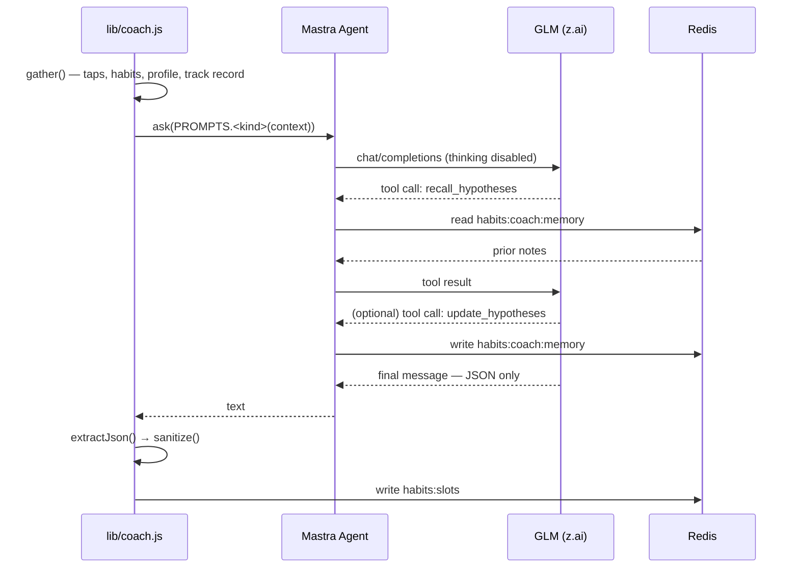

# Mastra in this project

How the AI coach is built, and why it's built this way.

The coach is a single [Mastra](https://mastra.ai) agent that decides what up to four Stream
Deck keys should ask you next. This page covers the wiring, the two decisions that are easy to
get wrong, and the boundary between what the model proposes and what the server accepts.

- **`@mastra/core`** `1.52.1` — the `Agent` and `createTool` primitives
- **`@ai-sdk/openai-compatible`** `3.0.14` — binds z.ai's GLM models to the agent
- **`zod`** `4.4.3` — tool input/output schemas

All three are **runtime** dependencies in `package.json` and load-bearing. They are not
optional extras to prune when trimming the Vercel bundle.

## Where it lives

| File | Role |
|---|---|
| [`lib/agent.js`](../lib/agent.js) | The agent: instructions, model binding, memory tools |
| [`lib/coach.js`](../lib/coach.js) | The six passes that call the agent, and what they do with the reply |
| [`lib/coach-shape.js`](../lib/coach-shape.js) | Prompt templates + the output sanitizer — deliberately dependency-free |
| [`lib/dataset.js`](../lib/dataset.js) | Captures each pass in Mastra-Dataset shape |
| [`lib/quality.js`](../lib/quality.js) | Rule-based scoring of coach output, used by the experiment runner |

## Why an agent framework at all

The coach isn't a single prompt-and-parse call. It needs to read its own prior notes before
deciding, write them back when its understanding changes, and do that across six different
entry points that share one personality. That's a tool-calling loop with persistent state —
exactly the shape an agent framework exists to own.

Mastra earns its place on three counts:

1. **The tool loop.** `recall_hypotheses` and `update_hypotheses` are declared once and the
   framework handles invocation, schema validation, and feeding results back into the
   conversation. Hand-rolling that is a state machine we'd rather not maintain.
2. **Provider indirection.** The agent binds to a model object, not to z.ai. Swapping
   providers is a change to one `createOpenAICompatible` call.
3. **Dataset compatibility.** Captured passes are stored in Mastra's `{input, output,
   metadata}` shape, so the corpus can move into Mastra's evals tooling without a migration.

## The agent

```js
new Agent({
  id: 'coach',
  name: 'Habit Coach',
  instructions: /* personality + the reply contract, see below */,
  model: provider(zaiModel()),
  tools: { recallHypotheses, updateHypotheses }
})
```

The instructions carry one framing that matters more than any other line in this repo:

> You control up to 4 extra keys — they are your **ONLY** voice to the human, your gateway for
> interacting with them.

The slot keys are the coach's entire interface to a person. Treat prompt and UX changes with
that framing: there is no chat window to clarify in, no notification to fall back on. Four
keys, an emoji and twelve characters each.

## ⚠️ The two things that are easy to get wrong

### 1. `thinking: { type: 'disabled' }` is not optional

GLM-5.x are **hybrid reasoning models**. Left alone, they spend the entire token budget
thinking and return nothing usable. The fix is a custom `fetch` that injects the disable flag
into every `/chat/completions` body before it leaves the process:

```js
function zaiFetch(url, init) {
  if (init?.body && String(url).includes('/chat/completions')) {
    const body = JSON.parse(init.body);
    if (!body.thinking) body.thinking = { type: 'disabled' };
    init = { ...init, body: JSON.stringify(body) };
  }
  return fetch(url, init);
}

createOpenAICompatible({ name: 'zai', baseURL, apiKey: zaiKey(), fetch: zaiFetch });
```

**Never construct the provider without that fetch.** It's the only guardrail — nothing
downstream detects or recovers from a reply that's all reasoning and no answer. This cost a
whole debugging cycle once already (PR #2).

### 2. Memory is tools + Redis, not Mastra's memory

Mastra ships memory primitives. We deliberately don't use them, because the coach runs in
**Vercel serverless functions**: in-process memory dies with the container, and a pass may run
minutes or hours after the last one on a completely different instance. Wiring up a full
storage adapter would mean adding a database layer to a project whose entire state is two
Redis keys.

Instead, memory is two ordinary Mastra tools over the `habits:coach:memory` Redis key:

| Tool | When | What |
|---|---|---|
| `recall_hypotheses` | start of every pass | Returns prior notes, or `(no notes yet — first session)` |
| `update_hypotheses` | when understanding changes | Overwrites notes (max 2000 chars), stamped `updatedAt` |

The model is instructed to call recall first on every pass and not to restate notes in its
reply — the tools *are* the memory. Because persistence is Redis, notes survive cold starts,
redeploys, and week-long gaps. This is the tradeoff recorded in issue #36; the cost is that we
own the read/write path, and the benefit is that the coach's identity is a durable Redis key
you can inspect, back up, or delete.

You can read the current notes at [`/mind.html`](https://stream-deck-habit-tracker.vercel.app/mind.html)
or via `GET /api/mind`.

## How a pass runs



Every pass goes through one function:

```js
export async function ask(request, { generate } = {}) {
  const gen = generate || ((prompt) => coachAgent().generate(prompt));
  const res = await gen(request);
  const text = typeof res === 'string' ? res : res?.text;
  if (!text || !text.trim()) throw new Error('agent returned no text');
  return { text, engine: 'mastra' };
}
```

`generate` is injectable purely so the unit suite can exercise `ask()` and everything above it
without a network or a Redis instance.

## The six passes

All six share one agent and one personality; they differ only in the prompt template and what
they do with the reply.

| Pass | Entry point | Trigger | Reply shape |
|---|---|---|---|
| Full refresh | `fullSuggest()` | ✨ Suggest button | `{"slots":[…]}` — replaces all four |
| Reactive | `reactTo(entry)` | every tap, 45 s cooldown | `{"change":false}` or `{"slots":[…]}` |
| Morning | `morningPass()` | cron, 10:00 UTC | `{"slots":[…]}` |
| Nudge | `nudgePass()` | rides the deck's `/api/slots` poll | `{"nudge":false}` or a single slot def |
| Roster | `rosterPass()` | after the morning pass | `{"proposals":[…]}` — queued for human approval |
| Digest | `dailyDigest()` | cron, 03:00 UTC | `{"insight":"…"}` |

The reactive pass runs in the background via `waitUntil` from `@vercel/functions`, *after*
`/api/log` has already answered the key — so a tap never waits on a model call. Its cooldown
is claimed in Redis **before** the model call, not after, so two taps landing together can't
both fire a pass.

## The trust boundary

The model's reply is treated as hostile input, because the same output paints a physical
device and lands in a log you'll read as fact.

1. **Parse defensively.** `extractJson` takes the first `{` to the last `}`. GLM routinely
   wraps JSON in code fences despite instructions not to; never assume a clean object.
2. **Sanitize server-side.** `sanitize()` in `coach-shape.js` enforces every rule
   independently of what the prompt asked for: habit names are `[A-Za-z0-9_-]` capped at 24
   chars, labels at 12, exactly one emoji, reasons at 160, `ttlMinutes` clamped to 15–720, at
   most 4 items, no duplicates of a fixed habit or of each other. Violations are dropped
   silently, never thrown on.
3. **Escape at render.** Key faces are SVG; every model-supplied string is XML-escaped in
   `streamdeck-plugin/src/faces.mjs`, and the dashboard escapes again at paint.

The prompt states these rules too, but only as a courtesy to the model. The enforcement is the
sanitizer — assume the prompt will be ignored and nothing breaks.

## Failure policy: no silent fallback

There is **no raw-z.ai fallback path**. An earlier design quietly rescued a failed agent call
with a direct API call, which meant a broken agent looked exactly like a working one. Now a
framework failure surfaces, and each caller decides how to fail:

| Pass | On failure |
|---|---|
| `reactTo`, `nudgePass` | No-op — already inside `waitUntil(…catch)`; keys stay as they were |
| `fullSuggest`, `morningPass`, `dailyDigest` | Return `null` → the API answers `502` |
| `rosterPass` | Queues nothing; never allowed to fail the morning keys pass |

The one place that still calls z.ai directly is `/api/experiment`, and that's deliberate —
see below.

## Datasets and experiments

Every slots-producing pass appends one item to `habits:dataset` (capped at 300): the exact
context the coach saw, its raw pre-sanitize output, and a live quality score from
`lib/quality.js`. Items use Mastra's `{input, output, metadata}` shape so the corpus is
portable into Mastra's evals tooling verbatim; storage stays in Redis to keep the Vercel
footprint small.

```
GET /api/experiment?run=1&models=glm-5.2,glm-4.7-flash&n=3
```

That replays the last *n* captured contexts against each model with **byte-identical** prompts
and rule-scores every reply. Run it — or the *Coach experiment* GitHub Action — before
shipping a prompt or model change, so "this prompt is better" is a measurement rather than an
impression.

**Why the experiment runner bypasses Mastra.** It calls `chat()` in `lib/ai.js` directly. A
model-vs-model comparison has to hold everything else constant, and going through the agent
would introduce tool calls whose results differ per run (memory changes between passes).
Comparing models means comparing *models*, not agent trajectories. This is the single
intentional exception to "the coach is purely Mastra-routed".

Roster passes are deliberately **not** captured: the dataset and `lib/quality.js` are
slot-shaped, and roster proposals aren't slots.

## Testing

CI's unit job runs **no `npm install`** — the unit suite is zero-dependency by design. That's
why the prompt templates and the sanitizer live in `lib/coach-shape.js` rather than
`lib/coach.js`: importing the shapes must not drag in `lib/agent.js` and therefore
`@mastra/core`. `lib/coach.js` re-exports both for backward compatibility.

So: keep `coach-shape.js` free of framework imports. If a test needs to reach the agent, inject
`generate` into `ask()` instead.

```bash
npm test          # unit — prompts, sanitizer, scorer, quality, JSON extraction
npm run test:e2e  # Chromium flows + the real plugin against a mock Stream Deck
```

## Adding a seventh pass

1. Add a prompt template to `PROMPTS` in `lib/coach-shape.js` (no framework imports).
2. Document its reply shape in the agent instructions in `lib/agent.js` — the model needs to
   know the contract, and every shape lives in one list.
3. Add the entry point in `lib/coach.js`, calling `ask()`.
4. Decide the failure mode explicitly and put it in the table above.
5. If it produces slots, call `capture()` so it lands in the dataset.
6. Unit-test the prompt and the sanitizer path with an injected `generate`.
